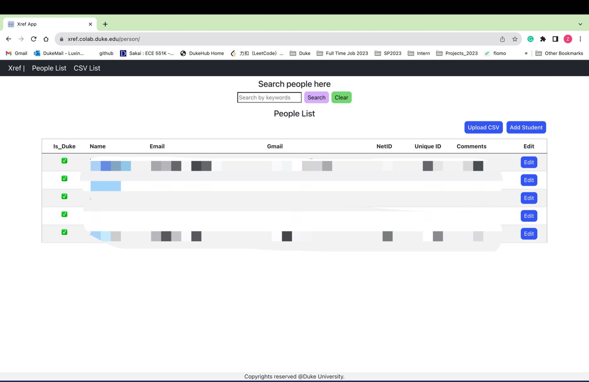
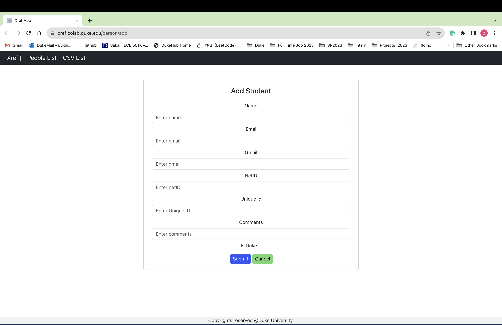
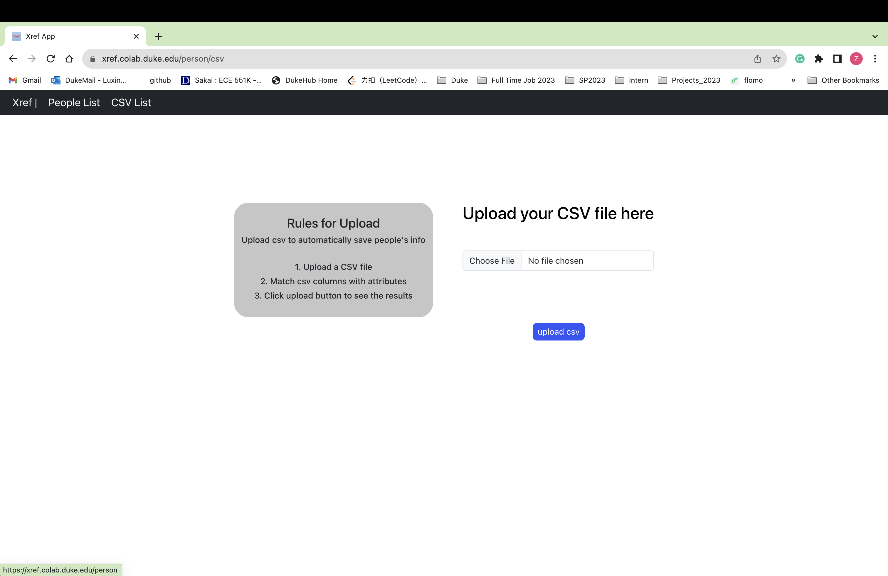
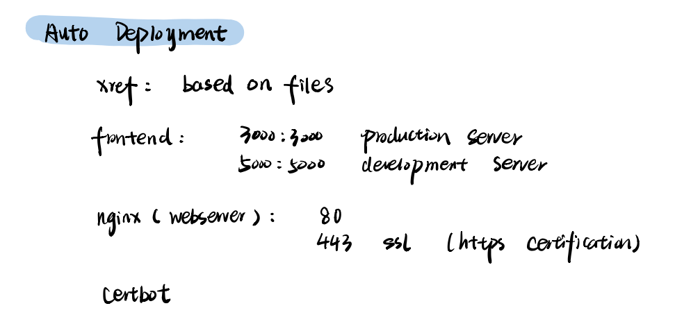

# Xref project: tracking people through many contexts
 Version 2, Auguest.18, 2023
 Group Members: Junhan Xu, Luxin Zhang, Yixin Cao, Yuhan Xue, Ruolin Xu
 Faculty sponsor: Tyler Bletsch

Xref is a cross reference platform that helps professors to track students easily, it allows uploading CSV files, manually adding student's information, and searching student based on information.

# Brief Introduction
Running on https://xref.colab.duke.edu/ with username ans password
## Home Page
This is the home page. 
   

## Add Student Page
This page is used to manually add students

## Upload CSV Page
This page is used to upload CSV - you need to specify each field before uploading

## Getting started
1. Production Documentation -> Production.md
This documentation includes everything you need to know for the production server, including how to generate a new certificate using certbot
2. Development Documentation -> Dovelopment.md
This documentation includes everything you need to know when producing or add new features for this platform

## Quick Overview of the project
It is a Django Rest + React Project. We used Nginx as the server and used docker for automatically deployment.
### Structure (Code Tree)

### Ports

